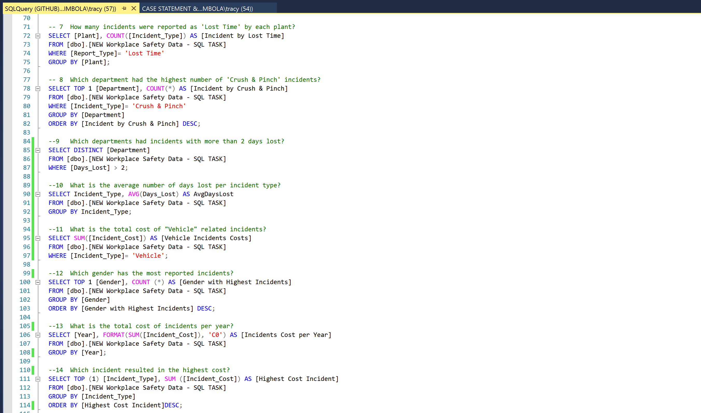
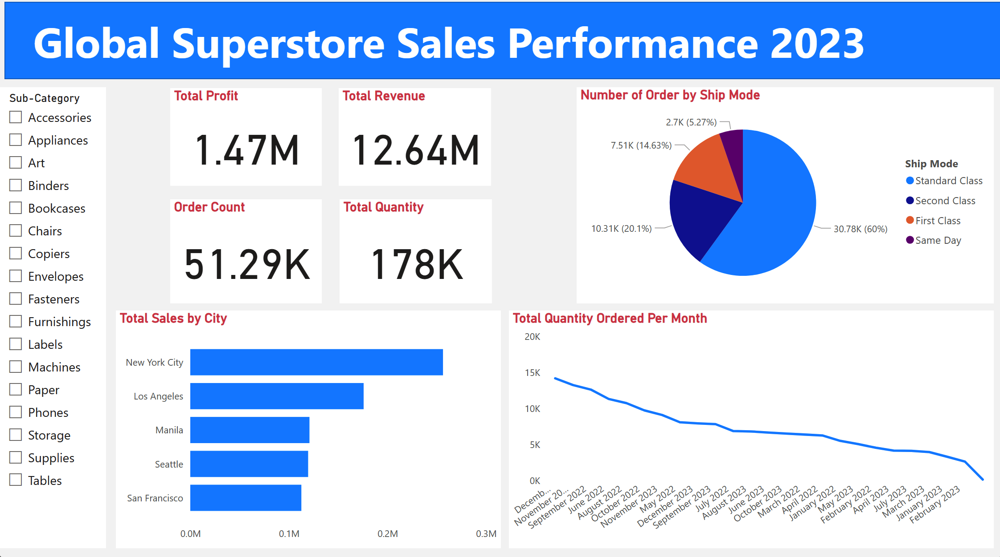
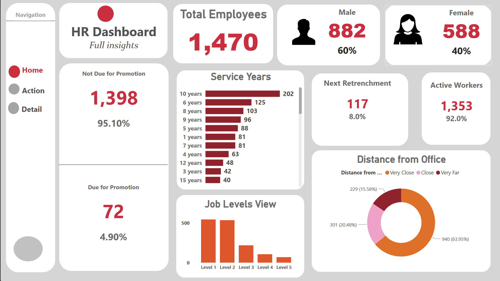

# Data Analytics Portfolio
# Project 1:

**Title:** [Workforce Analysis](https://github.com/AbisolaTracy/AbisolaTracy.github.io/blob/main/Workforce%20Analysis.xlsx)

**Tools Used:** 

Microsoft Excel (Pivot Tables, Pivot Charts, Slicers, Conditional Formatting,  Power Query Editor) 

**Project Description:** 

This project contains an interactive Excel dashboard designed to analyze workforce metrics. The goal of this project is to transform raw datasets into visually appealing and insightful reports that help businesses make data-driven decisions. The project also helps HR teams understand employee demographics, salary trends, and workforce distribution to support strategic decision-making. project's dashboard is designed with a clear structure, incorporating slicers, filters, and dynamic visuals to allow for easy exploration of key performance indicators (KPIs).

**Key Findings:** 
* Total Employees:
Displays an overview of 10,000 employees spread across 5 locations and 6 departments, aiding workforce planning.
* Demographic Insights: Analyzed workforce age, gender, experience, and education levels to support diversity initiatives and succession planning.
* Compensation Analysis: Identified departments with the highest salary costs, allowing leadership to monitor budget allocation effectively.
* Geographical Spread: The analysis indicated that the largest workforce is concentration in Austin, Texas.
* Experience Level: Most employees have **0–4 years of experience**, suggesting recent organizational growth.
* Job Title Analysis:
Majority of employees are Managers, followed by Analysts and Executives.
  
**Dashboard Overview:** 

The Workforce Dashboard provides a comprehensive overview of employee demographics, salary distribution, and departmental performance across multiple locations.
This dashboard helps HR teams and management track employee data and optimize workforce planning.

# Project 2:

**Title:** [Vrinda Sales Dashboard](https://github.com/AbisolaTracy/AbisolaTracy.github.io/blob/main/Vrinda%20Store%20Sales.xlsx)

**Project Description:** 

This project provides insights into order trends, revenue performance, and customer behavior across states and sales channels.
The project enables stakeholders to track business performance and identify opportunities to increase revenue. By combining data analytics, visualization, and design, this project showcase skills that are valuable for roles in data analytics, business intelligence, and reporting.

**Key Insights:**

* Total Revenue: Highlighted a total revenue of **₹21,441,209** in which female customers contribute **₹13,756,251,** significantly higher than male customers at **₹7,684,958**.
* Monthly Trends: Analyzed monthly sales fluctuations to understand market dynamics and adjust business strategies accordingly. Peak revenue recorded in March, with a gradual decline toward the end of the year. 
* Top Performing States: Identified the most profitable state and highlighted underperforming states where performance could be improved
      
**Tools & Techniques:** The following tools and features were used to build this dashboard:
* Microsoft Excel
    * Pivot Tables & Pivot Charts
    * Slicers and interactive filtering
    * Conditional formatting for KPI highlights
* Data Cleaning & Preparation
    * Used Excel formulas and Pivot Tables to structure and prepare raw data for reporting.

**Charts Used:**
* Line chart for monthly revenue trends.
* Vertical bar charts for orders by month, channel, and status.
* Pie chart for gender-based sales contribution.
* Horizontal bar charts for top 5 states with highest sales and orders by channel.
* Slicers for interactive filtering by date, month, category, and channel.
  
**Dashboard Overview:** 

This dashboard enables stakeholders to track revenue performance, customer behavior, and operational efficiency. The dashboard demonstrate the power of Excel in converting raw data into actionable insights. It is designed for sales teams and business managers to monitor revenue trends and improve performance strategies. 

 

**How to Use:**
1. Download the '.xlsx' files from the repository (Title).
2. Open them in **Microsoft Excel**.
3. Use slicers to filter data and interact with the dashboards.

# Project 3:

**Title:** [Netflix Insight](https://github.com/AbisolaTracy/AbisolaTracy.github.io/blob/main/Netflix%20Insight.xlsx)

**Tools & Technologies:** 
* Microsoft Excel: Data visualization and reporting
* Pivot Charts: Used for categorical breakdowns
* Slicers: For filtering by attributes such as type, genre, rating and title
* Custom Formatting: Netflix-themed black & red branding
  
**Project Description:** 

The goal of this Netflix Insight project was to uncover patterns in Netflix’s catalog, including the distribution of movies and TV shows, the dominance of different genres, the role of producing countries, and the maturity ratings of content. By transforming a large dataset of Netflix titles into an interactive, single-page dashboard, the project provides a clear and engaging way to understand how Netflix curates its global library.

The dashboard was designed with a **black-and-red Netflix theme** to capture the brand’s identity while presenting the data in a structured, visually appealing format. Easy to scan KPIs, filter by type or genre, and explore content distribution trends to gain actionable insights.

**Key Findings:** 
* From the insight, Netflix’s library is heavily skewed toward movies, with only a small fraction of TV shows.
* Uncovered that the United States is the dominant producing country, followed by India and the United Kingdom.
* Showed that Drama and Comedy titles account for the largest share of genres, reflecting audience demand.
* Found that TV-MA (Mature Audience) is the most frequent rating, highlighting Netflix’s focus on adult-oriented content.
* Identified that content additions peak on Fridays, aligning with Netflix’s release strategy to maximize weekend viewing.
* Tracked year-over-year growth in titles, showing how Netflix steadily expanded its catalog between 2018 and 2021.
  
**Data Source:** Kaggle
The dataset contains details of Netflix’s catalog, including titles, genres, directors, release years, ratings, and countries.
  
**Dashboard Overview:** 

The Netflix Dashboard combines Netflix’s catalog into a single, interactive Excel report. The dashboard displays headline KPIs such as total titles, directors, movies, and TV shows. Charts break down content by genre, rating, and producing country etc., making it easy to see which areas dominate the platform. A pie chart highlights the clear turn towards movies over TV shows, while horizontal and vertical bar charts show the most common genres and top producing countries. Finally, trend analysis captures how Netflix’s library has evolved over time, helping users see when most content was added.

# Project 4:

**Title:** [Superstore Sales Dashboard](https://github.com/AbisolaTracy/AbisolaTracy.github.io/blob/main/Superstore%20Analysis.xlsx)

**Tools & Techniques Used:** 
* Microsoft Excel: Data cleaning, transformation, and visualization
* Pivot Tables & Pivot Charts: For aggregations and drill-downs
* Excel Slicers & Filters: For interactivity and dynamic exploration
* Conditional Formatting: To highlight key KPIs

**Project Description:** 

The Superstore Sales Dashboard is a data visualization project built in Microsoft Excel to provide a clear, interactive view of retail sales performance. The dashboard was designed to help business users quickly identify trends, monitor key metrics, and make data-driven decisions. The dataset includes thousands of transactions across customers, products, categories, segments, and regions. Using pivot tables, slicers, and charts, the data was transformed into an interactive reporting tool that allows users to filter, drill down, and explore performance from different perspectives.

The dashboard focuses on answering critical business questions such as:
* Which customer segment is the most profitable?
* What are the top-performing products, regions, cities, and customers?
* Which products and categories drive the highest sales and profit?
* How do shipping modes affect business distribution?
* What are the monthly sales trends across the year?

**Key Findings:** 
* Total Sales: **$2,297,201**, with **$286,397** profit across **37,873** units of products.
* Consumer Segment dominates sales, making up over 50% of transactions.
* The West Region leads in performance with sales exceeding $725K.
* New York City is the top-performing city, contributing over $256K in sales.
* Standard Class shipping is the most used shipping mode.
* Technology products are the highest revenue driver across categories.

**Dashboard Features:** 

* KPIs at a glance: Total Sales, Total Quantity, Total Profit, Top Segment, Top Region.
* Sales Leaders by Customer (Top 10)
* Customer Segmentation (Consumer, Corporate, Home Office)
* Revenue Trends by Month
* Shipping Mode Analysis (Pie Chart)
* Top Performing Cities (Top 10 city)
* Category vs Segment Performance (Furniture, Office Supplies, Technology)
* Top Performing Products
* Regional Performance
  
  

# Project 5:
**Title:** Workplace Safety - Data Manipulation Interrogation

**SQL Code:** [Workplace SQL](https://github.com/AbisolaTracy/AbisolaTracy.github.io/blob/main/Workplace%20SQL)

**Project Description:** 

This project analyzes a dataset of workplace safety incidents recorded across multiple plants, departments, shifts, and employee demographics. Using SQL, I created insightful queries and reports that highlight key safety trends, cost impacts, and workforce risk factors. The main goal of this project is to demonstrate how SQL can be used for workplace safety analytics, helping organizations answer questions like:

* Which departments or plants have the highest number of incidents?
* What are the most costly or severe incident types?
* How are incidents distributed across shifts, age groups, and gender?
* Which areas of the workplace need the most attention to improve safety?

This analysis mimics real-world occupational health & safety reporting, where businesses rely on data to reduce workplace risks and improve safety culture.

**SQL Skills Used:** 
* Data Retrieval: The use of SELECT clause to query and extract specific information.
* Data Source Specification (FROM ): Specified the tables used as data sources for retrieval
* Aggregation & Grouping: Sum, Count of incidents per plant and department, days lost and average costs grouped by incident type.
* Filtering & Conditions: WHERE clause for conditions such as 'Lost Time', 'Near Miss', 'Falling Object', and the use of BETWEEN, IN, to filter specific results.
* Sorting & Ranking: ORDER BY to rank incident types, departments, and **TOP 1** to extract the most critical insights (e.g., highest incident cost, department with most crush & pinch injuries).
* Window Functions: Using OVER (PARTITION BY ...) to calculate max/min costs per incident type or department.
* Pattern Matching (Wildcards): LIKE, %, and _ operators to search for patterns in plant or department names.
* HAVING vs WHERE: Difference between filtering grouped data (HAVING) and filtering raw data (WHERE).

**Technology Used:** Microsoft SQL Server

# Project 6:
**Title:** Salesman SQL Project - Data Manipulation Interrogation

**SQL Code:** [Salesman SQL Codes](https://github.com/AbisolaTracy/AbisolaTracy.github.io/blob/main/Salesman%20SQL%20Codes)

**SQL Skills Used:** 

The project showcases a wide range of SQL skills such as:
* Basic SELECT queries: Retrieving columns with aliases and conditions.
* Filtering with WHERE: Using operators, ranges (BETWEEN), and comparisons.
* JOIN operations: Combining data across multiple tables (INNER JOIN, LEFT JOIN).
* ORDER BY Clause: Sorting results on numeric and string fields.
* Aggregation logic: Handling grouped conditions such as commission percentages.
* Cartesian Products: CROSS JOIN to create all possible combinations of salespeople and customers.
* NULL handling: Identifying customers or salesmen without relationships.
* Relational reporting: Combining customer, order, and salesman info into professional reports.

**Project Description:** 

This project is a collection of 20 SQL queries designed to practice and demonstrate core database skills using a simple Sales Management System.
The system consists of three relational tables: 
* Salesman: Contains details of salespeople, their working city, and commission rates.
* Customer: Stores information about customers, their assigned salesman, and grade level.
* Orders: Records orders placed by customers, including order date, purchase amount, and the salesperson involved.

The queries answer real-world business questions such as:
* Matching customers with their sales representatives.
* Filtering orders based on conditions (order amount, date, customer grade).
* Generating reports that combine customer, order, and salesman data.
* Creating Cartesian products to simulate potential sales assignments.
* Finding mismatches (e.g., salespeople and customers in different cities).
  
This project simulates the kind of SQL problem-solving needed in business intelligence, reporting, and database-driven application development.

**Technology Used:** 
* Database: Microsoft SQL Server
* Language: SQL (Structured Query Language)
* Schema: Sales Management Schema with 3 main tables: salesman, customer, and orders

# Project 7:

**Title:** [Global Sales](https://github.com/AbisolaTracy/AbisolaTracy.github.io/blob/main/Global%20Sales%20PROJECT%201.pbix)

**Tools & Technology Used:** 
* Power BI: For data visualization and dashboard creation
* Microsoft Excel: Data extraction, data cleaning and preprocessing
* DAX (Data Analysis Expressions): For calculated column (Total Quantity Ordered Per Month)
* Power Query: Data cleaning

**Project Description:** 

This project provides a comprehensive analysis of the Global Superstore's sales performance for the year 2023. It aims to uncover actionable insights through interactive visualizations that break down profits, revenue, order patterns, and customer behavior across regions and time.

The primary focus of this dashboard is to support data-driven decision-making by management and stakeholders. It can be used to identify top-performing markets, monitor logistics efficiency, and optimize inventory and marketing strategies.

**Key Findings & Business Value:** 

* Shipping Strategy Optimization: With 60% of all orders shipped via Standard Class, there's an opportunity to optimize logistics cost and renegotiate vendor contracts for higher volume shipments.
* Market Prioritization: Cities like New York City and Los Angeles are driving a significant portion of total sales, indicating where marketing and inventory resources should be prioritized.
* Decline in Order Volume: The "Total Quantity Ordered Per Month" chart shows a steady decline over time, signaling a potential demand dip or seasonal pattern. Investigating the root causes could help boost customer retention and seasonal campaign planning.
* Diversifying Shipping Modes: A low share of orders using **Same Day** shipping (only 5.27%) could indicate logistical constraints or untapped customer segments. Exploring partnerships or infrastructure improvements could enhance customer satisfaction and drive repeat purchases.
* Strong Revenue-Profit Ratio: The business is maintaining a healthy profit margin, which is a strong sign of operational efficiency. This allows room for scaling operations or reinvesting in marketing.
  
**Dashboard Overview:** 
* Top KPIs at a Glance:
* Total Profit, Total Revenue, Order Count, and Total Quantity are displayed in large, easy-to-read figures for executive overview.
* Sales Distribution by Ship Mode: A pie chart illustrates the distribution of orders by shipping mode, offering quick insights into customer preferences and delivery channel usage.
* Geographic Sales Insights: A bar chart highlighting top-performing cities helps identify strong markets and potential areas for expansion.
* Time Series Analysis: A trend line showing "Total Quantity Ordered Per Month" allows users to track performance fluctuations and plan demand forecasting.
* Sub-Category Filter: Interactive checkboxes for filtering sales performance by sub-category give users deeper drill-down capabilities.
  

# Project 8:

**Title:** HR Insight

**Tools & Technology Used:** 
* Power BI: For building interactive, dynamic visualizations.
* DAX (Data Analysis Expressions): To create custom KPIs and dynamic measures
* Microsoft Excel: Data extraction, data cleaning and preprocessing
* Power Query: Data cleaning

**Project Description:** 

The HR Dashboard is a comprehensive data visualization solution built to monitor and evaluate the overall human resource landscape of a company. It provides key HR metrics including workforce composition, promotion eligibility, service tenure, and geographical proximity of employees to their workplace.

The goal of this project is to enable HR leaders and decision-makers to proactively manage the workforce, support data-driven strategies for retention, promotion, and retrenchment, and enhance employee satisfaction through evidence-based policy improvements.

**Key Findings:** 

* Employee Growth Visibility: Only 4.90% of employees are due for promotion, indicating a stable workforce but also highlighting the need to review career progression pathways to avoid future stagnation.
* Service Tenure Insights: A large portion of employees have 10+ years of service, which signals organizational loyalty, but may also call for succession planning and potential upskilling programs to ensure ongoing performance and innovation.
* Retrenchment Watchlist: 8% of employees are marked for next retrenchment, offering HR teams a window to review performance, redeployment, or upskilling options to reduce attrition costs and maintain morale.
* Proximity Analysis: A significant number of employees (63.95%) live very close to the office, which can boost productivity, reduce absenteeism, and improve work-life balance. The organization could further explore remote or hybrid options for those living far away to enhance retention.
* Gender Diversity: With a 60/40 male-to-female split, the company maintains moderate gender diversity. This metric can be tracked over time to support diversity, equity, and inclusion (DEI) initiatives.
* Workforce Activity Levels: 92% of employees are currently active, showcasing a high engagement rate. However, tracking this metric over time can help spot early signs of disengagement.
* Job Level Distribution: The majority of employees are clustered in Levels 1 and 2, suggesting a large operational or junior workforce. This insight supports decisions related to training, leadership development, and succession planning.
  
**Dashboard Overview:** 
* Top-Level Metrics:
* Total Employees, Gender Distribution, Promotion Eligibility, Active Workers, and Retrenchment Risk.
* Tenure Analysis: Horizontal bar chart showing employee distribution by years of service.
* Job Levels Breakdown: Bar chart that visualizes the hierarchy across job levels (Level 1 to Level 5).
* Proximity to Workplace: Donut chart categorizing employee distance from office: Very Close, Close, and Very Far.
* Navigation Panel: Left-side menu to switch between different dashboard views: Home, Action, and Detail for a deeper dive.

