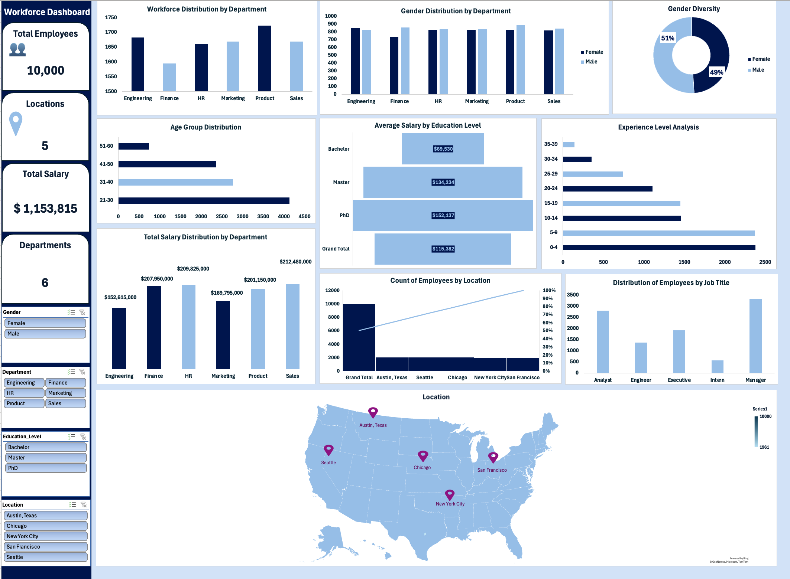
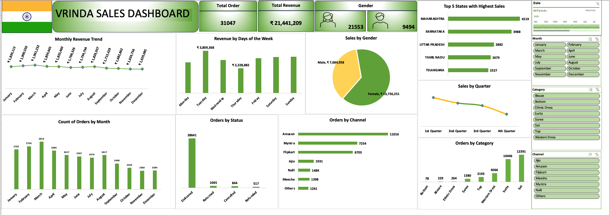
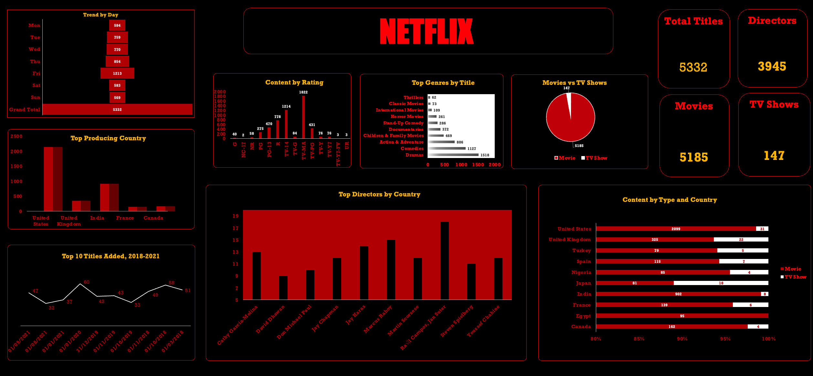
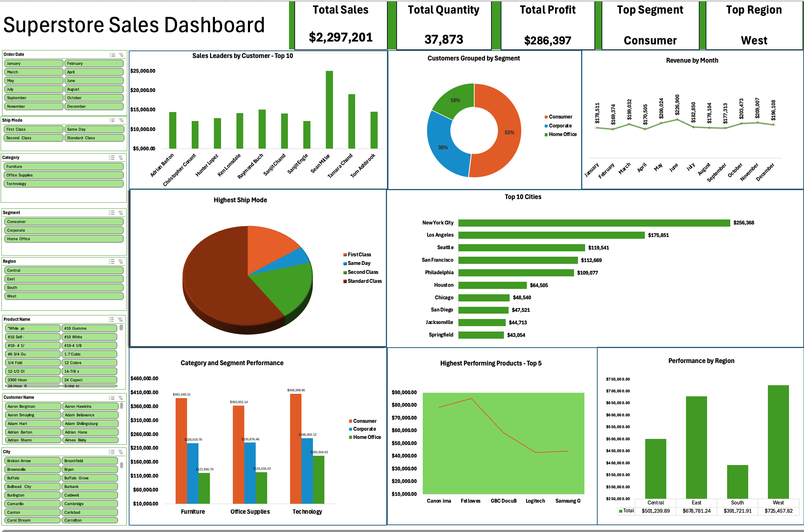

# Data Analytics Portfolio
# Project 1:

**Title:** [Workforce Analysis](https://github.com/AbisolaTracy/AbisolaTracy.github.io/blob/main/Workforce%20Analysis.xlsx)

**Tools Used:** Microsoft Excel (Pivot Tables, Pivot Charts, Slicers, Conditional Formatting,  Power Query Editor) 

**Project Description:** This project contains an interactive Excel dashboard designed to analyze workforce metrics. The goal of this project is to transform raw datasets into visually appealing and insightful reports that help businesses make data-driven decisions. The project also helps HR teams understand employee demographics, salary trends, and workforce distribution to support strategic decision-making. project's dashboard is designed with a clear structure, incorporating slicers, filters, and dynamic visuals to allow for easy exploration of key performance indicators (KPIs).

**Key Findings:** 
* Total Employees:
Displays an overview of 10,000 employees spread across 5 locations and 6 departments, aiding workforce planning.
* Demographic Insights: Analyzed workforce age, gender, experience, and education levels to support diversity initiatives and succession planning.
* Compensation Analysis: Identified departments with the highest salary costs, allowing leadership to monitor budget allocation effectively.
* Geographical Spread: The analysis indicated that the largest workforce is concentration in Austin, Texas.
* Experience Level: Most employees have **0–4 years of experience**, suggesting recent organizational growth.
* Job Title Analysis:
Majority of employees are Managers, followed by Analysts and Executives.
  
**Dashboard Overview:** The Workforce Dashboard provides a comprehensive overview of employee demographics, salary distribution, and departmental performance across multiple locations.
This dashboard helps HR teams and management track employee data and optimize workforce planning.

# Project 2:

**Title:** [Vrinda Sales Dashboard](https://github.com/AbisolaTracy/AbisolaTracy.github.io/blob/main/Vrinda%20Store%20Sales.xlsx)

**Project Description:** This project provides insights into order trends, revenue performance, and customer behavior across states and sales channels.
The project enables stakeholders to track business performance and identify opportunities to increase revenue. By combining data analytics, visualization, and design, this project showcase skills that are valuable for roles in data analytics, business intelligence, and reporting.

**Key Insights:**
* Total Revenue: Highlighted a total revenue of **₹21,441,209** in which female customers contribute **₹13,756,251,** significantly higher than male customers at **₹7,684,958**.
* Monthly Trends: Analyzed monthly sales fluctuations to understand market dynamics and adjust business strategies accordingly. Peak revenue recorded in March, with a gradual decline toward the end of the year. 
* Top Performing States: Identified the most profitable state and highlighted underperforming states where performance could be improved
      
**Tools & Techniques:** The following tools and features were used to build this dashboard:
* Microsoft Excel
    * Pivot Tables & Pivot Charts
    * Slicers and interactive filtering
    * Conditional formatting for KPI highlights
* Data Cleaning & Preparation
    * Used Excel formulas and Pivot Tables to structure and prepare raw data for reporting.

**Charts Used:**
* Line chart for monthly revenue trends.
* Vertical bar charts for orders by month, channel, and status.
* Pie chart for gender-based sales contribution.
* Horizontal bar charts for top 5 states with highest sales and orders by channel.
* Slicers for interactive filtering by date, month, category, and channel.
  
**Dashboard Overview:** This dashboard enables stakeholders to track revenue performance, customer behavior, and operational efficiency. The dashboard demonstrate the power of Excel in converting raw data into actionable insights. It is designed for sales teams and business managers to monitor revenue trends and improve performance strategies. 

 

**How to Use:**
1. Download the '.xlsx' files from the repository (Title).
2. Open them in **Microsoft Excel**.
3. Use slicers to filter data and interact with the dashboards.

# Project 3:

**Title:** [Netflix Insight](https://github.com/AbisolaTracy/AbisolaTracy.github.io/blob/main/Netflix%20Insight.xlsx)

**Tools & Technologies:** 
* Microsoft Excel: Data visualization and reporting
* Pivot Charts: Used for categorical breakdowns
* Slicers: For filtering by attributes such as type, genre, rating and title
* Custom Formatting: Netflix-themed black & red branding
  
**Project Description:** The goal of this Netflix Insight project was to uncover patterns in Netflix’s catalog, including the distribution of movies and TV shows, the dominance of different genres, the role of producing countries, and the maturity ratings of content. By transforming a large dataset of Netflix titles into an interactive, single-page dashboard, the project provides a clear and engaging way to understand how Netflix curates its global library.

The dashboard was designed with a **black-and-red Netflix theme** to capture the brand’s identity while presenting the data in a structured, visually appealing format. Easy to scan KPIs, filter by type or genre, and explore content distribution trends to gain actionable insights.

**Key Findings:** 
* From the insight, Netflix’s library is heavily skewed toward movies, with only a small fraction of TV shows.
* Uncovered that the United States is the dominant producing country, followed by India and the United Kingdom.
* Showed that Drama and Comedy titles account for the largest share of genres, reflecting audience demand.
* Found that TV-MA (Mature Audience) is the most frequent rating, highlighting Netflix’s focus on adult-oriented content.
* Identified that content additions peak on Fridays, aligning with Netflix’s release strategy to maximize weekend viewing.
* Tracked year-over-year growth in titles, showing how Netflix steadily expanded its catalog between 2018 and 2021.
  
**Data Source:** Kaggle
The dataset contains details of Netflix’s catalog, including titles, genres, directors, release years, ratings, and countries.
  
**Dashboard Overview:** The Netflix Dashboard combines Netflix’s catalog into a single, interactive Excel report. The dashboard displays headline KPIs such as total titles, directors, movies, and TV shows. Charts break down content by genre, rating, and producing country etc., making it easy to see which areas dominate the platform. A pie chart highlights the clear turn towards movies over TV shows, while horizontal and vertical bar charts show the most common genres and top producing countries. Finally, trend analysis captures how Netflix’s library has evolved over time, helping users see when most content was added.

# Project 4:

**Title:** [Superstore Sales Dashboard](https://github.com/AbisolaTracy/AbisolaTracy.github.io/blob/main/Superstore%20Analysis.xlsx)

**Tools & Techniques Used:** 
* Microsoft Excel: Data cleaning, transformation, and visualization
* Pivot Tables & Pivot Charts: For aggregations and drill-downs
* Excel Slicers & Filters: For interactivity and dynamic exploration
* Conditional Formatting: To highlight key KPIs

**Project Description:** The Superstore Sales Dashboard is a data visualization project built in Microsoft Excel to provide a clear, interactive view of retail sales performance. The dashboard was designed to help business users quickly identify trends, monitor key metrics, and make data-driven decisions. The dataset includes thousands of transactions across customers, products, categories, segments, and regions. Using pivot tables, slicers, and charts, the data was transformed into an interactive reporting tool that allows users to filter, drill down, and explore performance from different perspectives.

The dashboard focuses on answering critical business questions such as:
* Which customer segment is the most profitable?
* What are the top-performing products, regions, cities, and customers?
* Which products and categories drive the highest sales and profit?
* How do shipping modes affect business distribution?
* What are the monthly sales trends across the year?

**Key Findings:** 
* Total Sales: **$2,297,201**, with **$286,397** profit across **37,873** units of products.
* Consumer Segment dominates sales, making up over 50% of transactions.
* The West Region leads in performance with sales exceeding $725K.
* New York City is the top-performing city, contributing over $256K in sales.
* Standard Class shipping is the most used shipping mode.
* Technology products are the highest revenue driver across categories.

**Dashboard Features:** KPIs at a glance: Total Sales, Total Quantity, Total Profit, Top Segment, Top Region.
* Sales Leaders by Customer (Top 10)
* Customer Segmentation (Consumer, Corporate, Home Office)
* Revenue Trends by Month
* Shipping Mode Analysis (Pie Chart)
* Top Performing Cities (Top 10 city)
* Category vs Segment Performance (Furniture, Office Supplies, Technology)
* Top Performing Products
* Regional Performance
  
  

# Project 5:
**Title:** Customer Insight - Data Manipulation Interrogation

**SQL Code:** [Customer Insight – SQL Codes] ()

¡[] ()

**SQL Skills Used:** 

Data Retrieval (SELECT): Queried and extracted specific information from the database.

Data Source Specification (FROM): Specified the tables used as data sources for retrieval

Data Aggregation (SUM, COUNT, AVERAGE): Calculated totals, such as sales and quantities, and counted records to analyze data trends.

Data Filtering: (WHERE, BETWEEN, IN, AND): Applied filters to select relevant data, including filtering by ranges and lists.

**Project Description:** 

**Technology Used:** SQL Server

